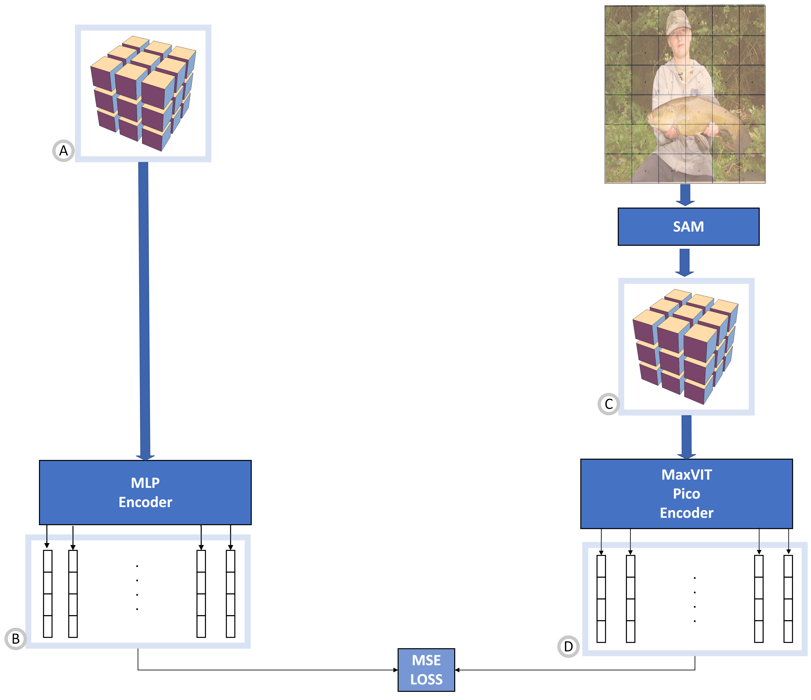
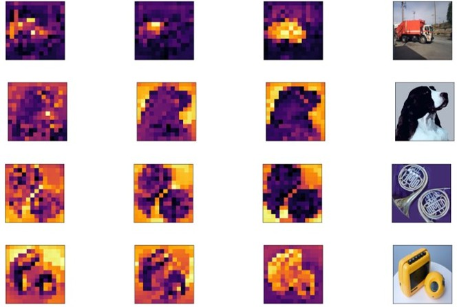

# Distilling Part-whole Hierarchical Knowledge from a Huge Pretrained Class Agnostic Segmentation Framework
Official code for "Distilling Part-whole Hierarchical Knowledge from a Huge Pretrained Class Agnostic Segmentation Framework" ([Ahmed Radwan](https://scholar.google.com/citations?user=LCz8YhMAAAAJ&hl=en), [Mohamed S. Shehata](https://scholar.google.com/citations?hl=en&user=i9PpMVkAAAAJ)) (Accepted for ICCV'23's Workshop Visual Inductive Priors for Data-Efficient Deep Learning) \[[pdf](https://openreview.net/pdf?id=pMo0hV6xQz)\]

## Requirements Setup

From the main directory run:

``pipenv install``

to install the required dependencies for the Agglomerator.

## SAM Setup

``pip install git+https://github.com/facebookresearch/segment-anything.git``

## Dataset

We performed our experiments on Imagenette. Download the full size version from [here] (https://s3.amazonaws.com/fast-ai-imageclas/imagenette2.tgz)
then place it in datasets/imagenette2

## Generating SAM Masks

Firstly, we will generate the multi-output SAM masks for our dataset with the desired configurations.
For examples to generate the masks for the validation set and for the particular configuration defined in ``config/config_IMAGENETTE.cfg`` we would like to divide an image with size 224 x 224 into 14 x 14 (i.e patches each with size 16 x 16), so we execute:

``python src/hierarchical_masks/patched_masks.py --device=cuda:1 --split=val --in_data_path=path_to_val_input_images --out_data_path=path_to_out_val_masks --sam_checkpoint=path_to_vit_h_sam_checkpoint --sam_model_type=vit_h --img_size 224 --patch_size=16``

this will generate a pickled file for each image containing 14 x 14 x 3 masks

## Generating Masks embeddings

After generating the masks, we need to generate the embeddings for them. We use an encoder that matches the desired patch dimension. For example, to generate the embeddings without cropping and also to match the patch_dim in the config file in ``config/config_IMAGENETTE.cfg`` we might use the pretrained model ``maxvit_rmlp_pico_rw_256.sw_in1k`` to generate the embeddings for the validation set, we execute:

``python src/hierarchical_masks/masks_to_embeds.py --in_masks_path=path_to_the_sam_generated_masks --in_images_path=path_to_images_used_to_gen_sam_masks --out_data_path=project_root_path/datasets/imagenette2/val_masks_embeds --encoder_model_name='maxvit_rmlp_pico_rw_256.sw_in1k'``

## Training / Validation

Update the configuration file with the desired parameters then, for example, to run pre-training on Imagenette on GPU 0, execute:

``CUDA_VISIBLE_DEVICES=0 python src/main.py --flagfile config/config_IMAGENETTE.cfg``

After running the pre-training you can run the training phase with:

``CUDA_VISIBLE_DEVICES=0 python src/main.py --flagfile config/config_IMAGENETTE.cfg --resume_training --supervise --load_checkpoint_dir <path_to_checkpoint.ckpt>``

To run testing or to freeze the network weights, set the 'mode' flag (e.g. ``--mode test`` or ``--mode freeze``). 
Refer to [this page](src/flags_Agglomerator.py) for additional info about each flag.

## Pre-trained models

We provide [pre-trained models](https://drive.google.com/drive/folders/1fydLRfoyZVsKKZYgKHrjh2lfstLWGbh1?usp=sharing) that can be used to plot islands of agreement or fine-tune for image classification. To fine-tune a pretrained model, just run:

``CUDA_VISIBLE_DEVICES=0 python src/main.py --flagfile config/config_CIFAR10.cfg --patch_size 1 --patch_dim 128 --resume_training --supervise --load_checkpoint_dir path_to_pretrained_model.ckpt``

## Plotting islands of agreement

To enable live visualization of the islands of the agreement during training/val/test, set the flag ``--plot_islands``.

## Citing

    @inproceedings{
      radwan2023distilling,
      title={Distilling Part-whole Hierarchical Knowledge from a Huge Pretrained Class Agnostic Segmentation Framework},
      author={Ahmed Mostafa Soliman Radwan and Mohamed S. Shehata},
      booktitle={4th Visual Inductive Priors for Data-Efficient Deep Learning Workshop},
      year={2023},
      url={https://openreview.net/forum?id=pMo0hV6xQz}
    }

## Credits

- Theoretical idea by [Geoffrey Hinton](https://arxiv.org/pdf/2102.12627.pdf)
- Agglomerator model by [mmlab-cv](https://github.com/mmlab-cv/Agglomerator)
- Pretrained models for generating the masks embedding by [Ross Wightman](https://github.com/huggingface/pytorch-image-models)
